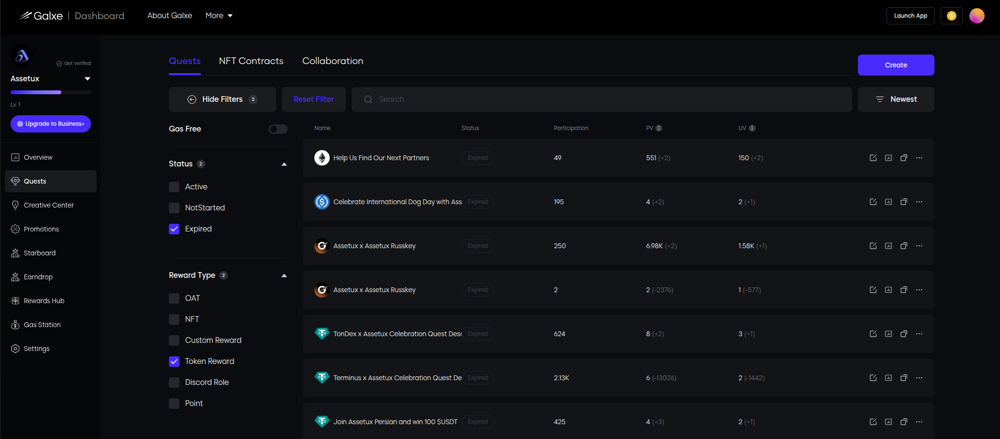
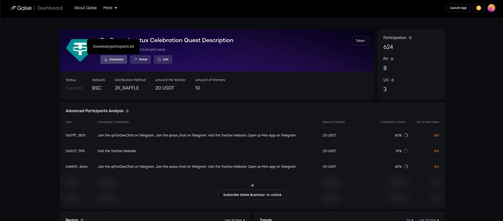
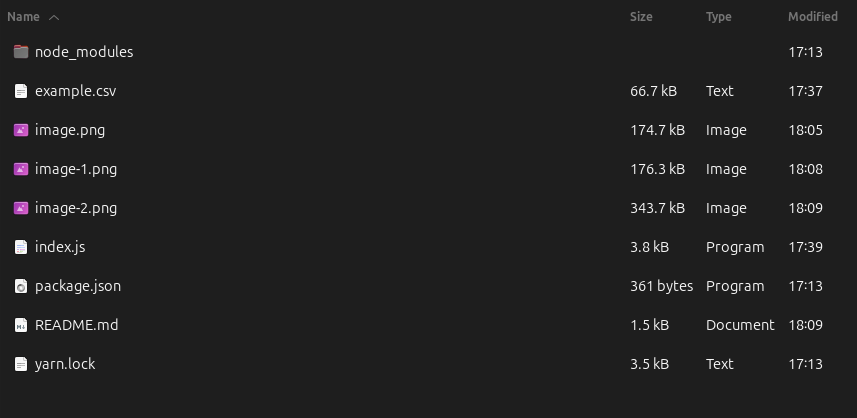
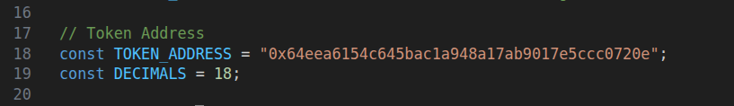
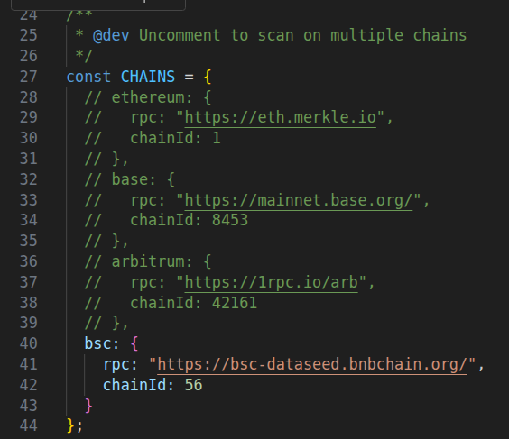

# Galxe-Winners-Analyzer

Analyze Galxe campaign participants by checking **any custom (ERC20) token balances across multiple chains**
and calculating winner & eligibility statistics.

---

##### Requirements

* Node.js **v18+**
* Internet connection (public RPCs)
* CSV file with valid EVM addresses

---

### 2️⃣ Install dependencies

```shell
npm install
```

---


### 1️⃣ Add `example.csv` file to the project folder

The CSV must contain:

* a column with **EVM wallet addresses**
* a column indicating **winner status** (e.g. contains `winner` text)

### Export winner list from Galxe

Select a quest from the Dashboard [dashboard.galxe.com](https://dashboard.galxe.com/quests)



Find the Data Report at the right side of the screen and press it.


Find "Download" button under the quest title



Save the file as "example.csv" to the same folder as this file. 



#### Example of the output file

```csv
address,id,__typename,email,telegramUserID,winner
0x07ff668f34fb6e9368ff185a25d1240af4ed3875,R2GPmsAdgoeBkhqykthLTH,Address,email@gmail.com,7595036423,winner
0x0c178d0cf91d513c55dbcd65eae4b9e5b4467951,xkSNyuGztkrNz5AGW2NwR6,Address,email@gmail.com,,
```

---

### Change the token contract address to the one you want to scan balances for.



#### If your token uses the same address for multiple chains uncomment that 



---


### 3️⃣ Run script in the console

```shell
node index.js
```

---

### 4️⃣ Output

* `wallets.updated.csv`
  → original CSV + new token balance column

* Console statistics:

  * total processed wallets
  * % of wallets with token balance > 1.00 (customize at line)
  * % of wallets marked as winners
  * live progress during execution


```
Processed: 9/9 | Remaining: 0
====================================
Done in 5.0s
Total wallets: 9
Valid wallets: 9
> 1 miUSD: 9 (100.00%)
Winners: 5 (55.56%)
CSV saved as: example.updated.csv
====================================
```